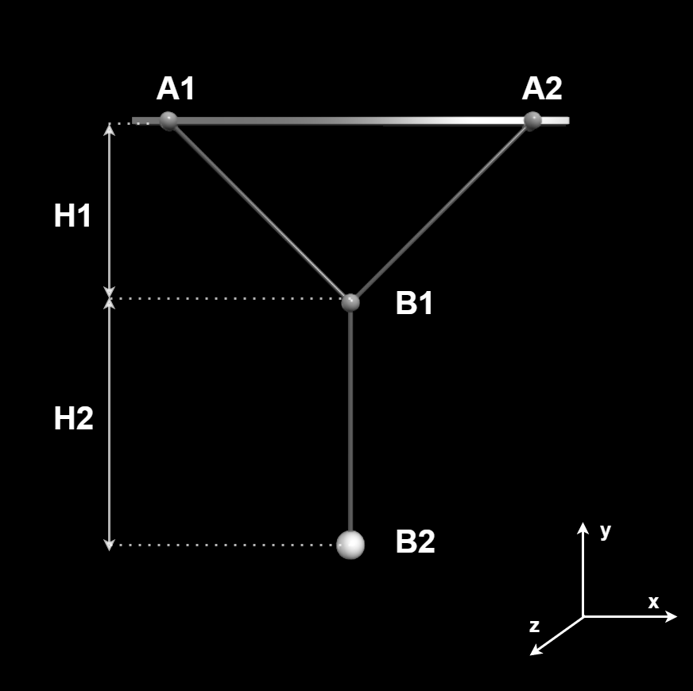
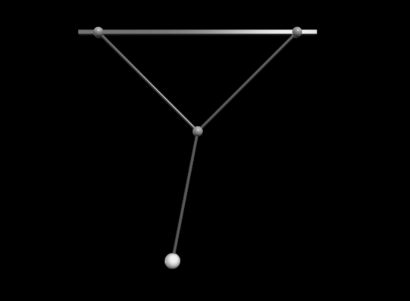
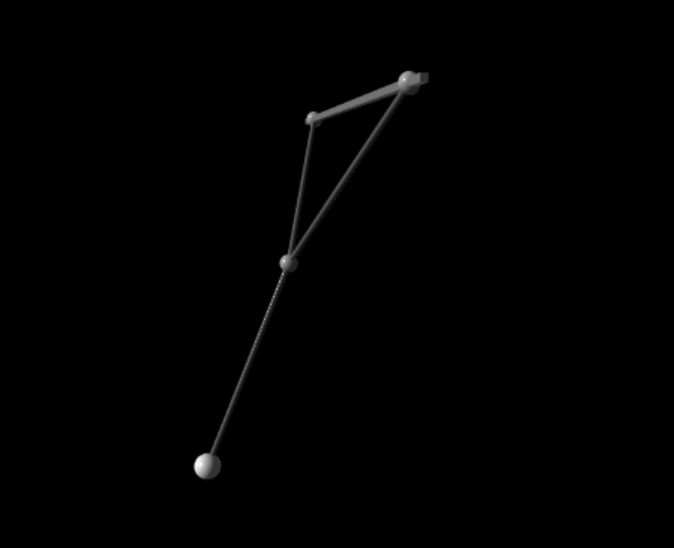

# Lisajous Pendulum Simulator


### Modelling The Pendulum


```theta``` models the oscillation in the z plane.
```
phi = phi0 * cos(omega2 * t) * exp(-alpha * t)
```


```phi``` models the oscillation in the x plane.
```
theta = theta0 * cos(omega1 * t) * exp(-alpha * t)
```




```alpha``` is the friction coeficient.

### Installation
```sh
$ pip install vpython
```

